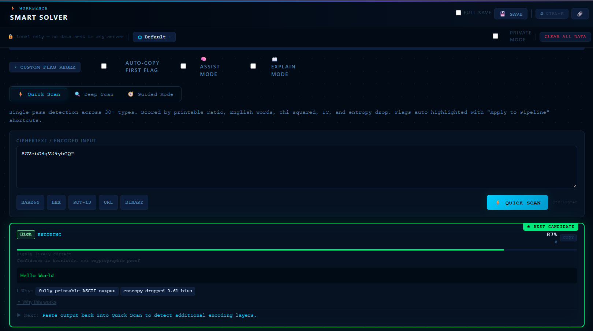
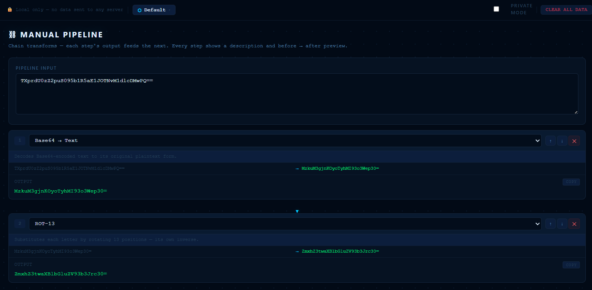

# ⬡ CryptoKit

[](https://github.com/PratikHarke/cryptokit/actions/workflows/ci.yml)

CryptoKit is a privacy-first browser-based CTF and security analysis workbench for decoding, transforming, inspecting, and solving encoded payloads locally.

CryptoKit is designed to run fully client-side with no backend, analytics, or intentional network transmission.

---

## Live Demo

https://YOUR-VERCEL-URL.vercel.app

---

## Why CryptoKit?

Many CTF and payload analysis workflows rely on online tools that require users to paste potentially sensitive data into external services.

CryptoKit was built to provide a privacy-first alternative that performs analysis entirely in the browser without requiring a backend or intentional network transmission.

---

## Screenshots

### Smart Solver


### File Analyzer


### Manual Pipeline


---

## What is CryptoKit?

CryptoKit is a browser-based platform for CTF competitions, security research, and cryptography education. It combines automated detection, layered decoding, forensic inspection, cryptanalysis tooling, and workflow-oriented utilities into a unified environment for security experimentation and payload analysis.

It combines:

- **Smart auto-detection** with confidence scores and reasoning
- **Multi-layer automatic solving** for layered CTF encodings
- **Explainable results** — every suggestion explains *why*
- **Composable transform pipelines** for precise step-by-step analysis
- **CTF Writeup Generator** that records your steps and exports clean Markdown

---

## Workbench Tools

| Tool | Purpose |
|---|---|
| 🧠 **Smart Solver** | Auto-detect and decode in Quick Scan, Deep Scan, or Guided Mode |
| ⛓ **Manual Pipeline** | Composable transform pipelines with intermediate output previews |
| 📂 **File Analyzer** | Drop any file — strings, entropy, magic bytes, hex dump |
| ⊕ **XOR Analyzer** | Encrypt · Single-byte brute force · Repeating-key crack · Crib drag |
| # **Hash Analyzer** | Identify · Generate · Verify · Dictionary attack · Argon2 |
| 🪙 **JWT Inspector** | Decode · audit claims · alg:none attack |
| 📝 **CTF Writeup Generator** | Collect steps automatically, annotate, export as Markdown |
| 🏁 **Challenge Mode** | 15 built-in CTF puzzles with a leaderboard |

---

## Additional Tools

### Encoding
Base64, Base Converter, Morse Code, URL/HTML/Unicode

### Classical Ciphers
Caesar, ROT-13, Vigenère, Atbash, Affine, Bacon, Playfair, Rail Fence

### Cryptanalysis
Caesar Bruteforce, Vigenère Crack (Kasiski + IC), Substitution Solver, Frequency Analysis

### Modern Crypto
RSA Attacks (Fermat, Wiener, GCD), AES Block Mode Visualizer, Number Theory

### Steganography
LSB image steganography (hide/extract)

### Utilities
Entropy Visualizer, Password Auditor, Cipher Wheel

---

## Smart Solver — Modes

### ⚡ Quick Scan

Single-pass detection over 30+ formats and transform types. Returns ranked candidates with confidence scores and explainable reasoning.

### 🔍 Deep Scan

Beam-search multi-layer solver that explores transform chains such as:

```txt
Base64 → XOR → Caesar
Hex → Base64 → URL Decode
